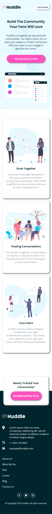
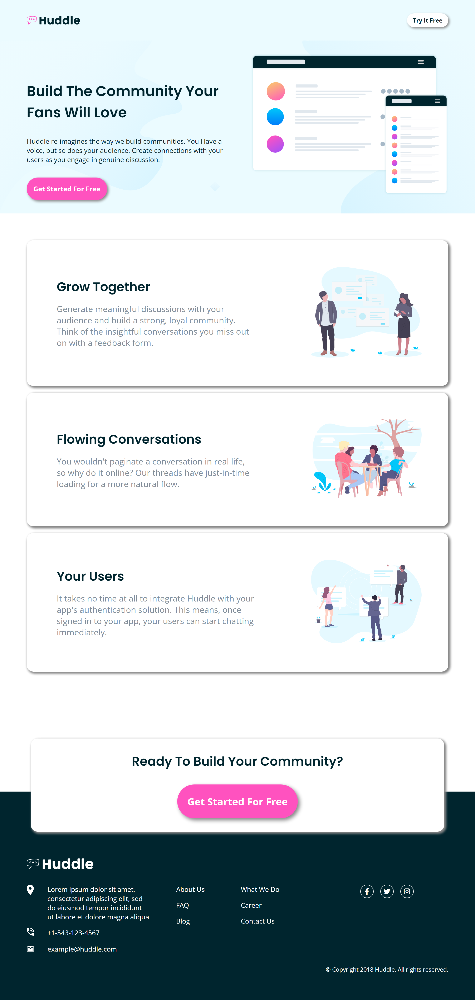

# Frontend Mentor - Huddle landing page with alternating feature blocks solution

This is a solution to the [Huddle landing page with alternating feature blocks challenge on Frontend Mentor](https://www.frontendmentor.io/challenges/huddle-landing-page-with-alternating-feature-blocks-5ca5f5981e82137ec91a5100).

## Table of contents

- [Overview](#overview)
  - [The challenge](#the-challenge)
  - [Screenshot](#screenshot)
  - [Links](#links)
- [My process](#my-process)
  - [Built with](#built-with)
  - [What I learned](#what-i-learned)
  - [Useful resources](#useful-resources)
- [Author](#author)

## Overview

### The challenge

Users should be able to:

- View the optimal layout for the site depending on their device's screen size
- See hover states for all interactive elements on the page

### Screenshot

#### Mobile preview

#### Desktop preview

### Links

- [Github repo](https://github.com/nurmarief/fementor_huddle-landing-page-with-alternate-blocks/)
- [Live site](https://nurmarief.github.io/fementor_huddle-landing-page-with-alternate-blocks/)

## My process

### Built with

- Semantic HTML5 markup
- BEM architecture for CSS
- SASS
- Mobile-first workflow
- Webpack 5

### What I Learned

In this challenge I learn about some SASS features:

1. SASS mixins
2. At-rules: @mixins, @include, @content
3. built-in modules: sass:color

### Useful resources

- [fontawesome](https://www.fontawesome.com)

## Author

- [@nurmarief](https://www.frontendmentor.io/profile/nurmarief)
